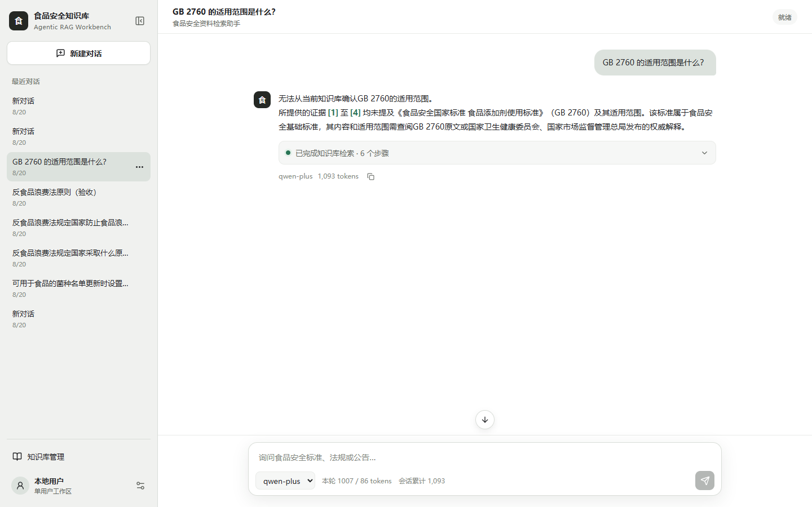
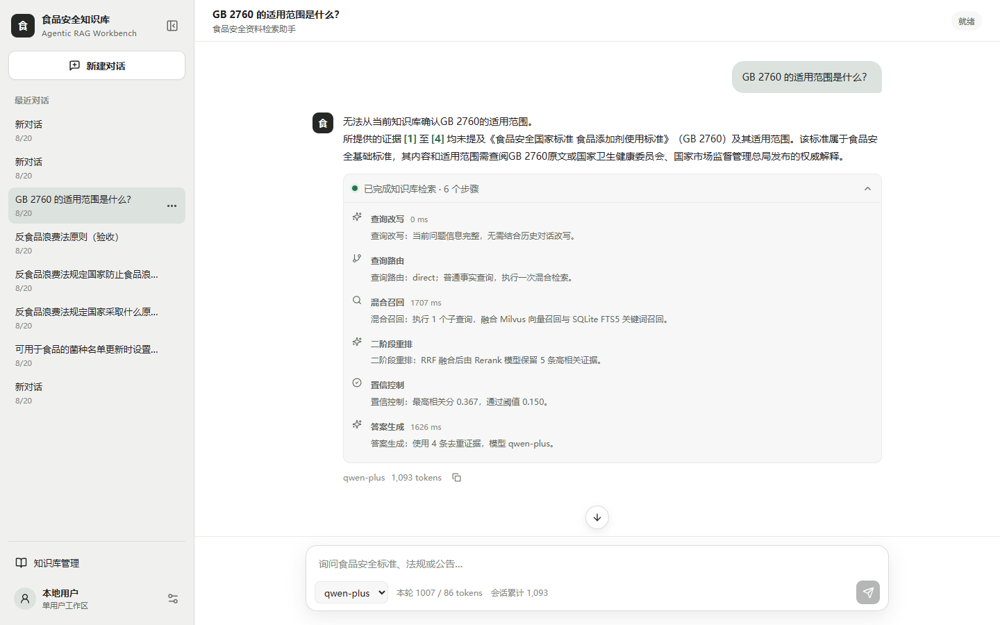
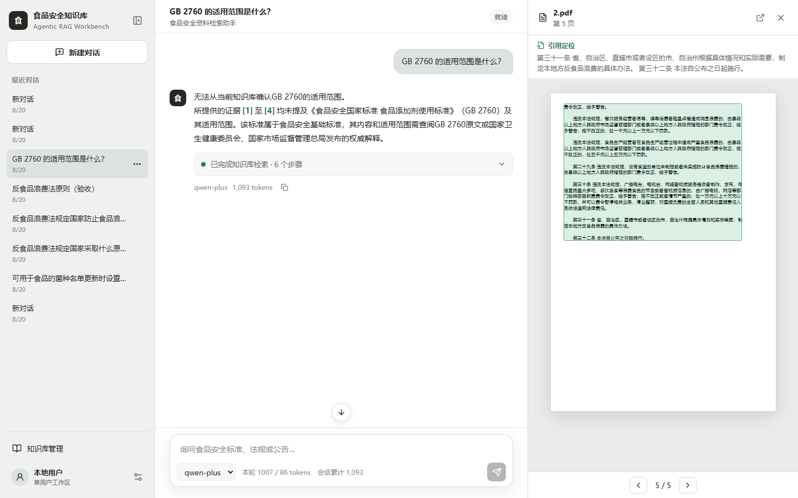
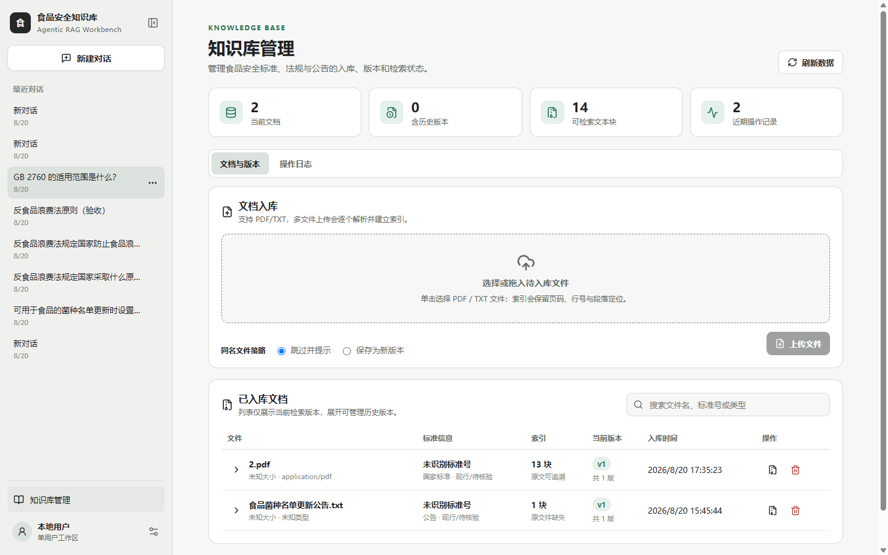

# 基于 Qwen 与 Milvus 的食品安全 Agentic RAG 工作台

面向食品安全标准、法规、公告和指南资料分散、人工检索与条款核验效率低的问题，本项目提供文档入库、混合检索、可观测问答和原文追溯能力。系统不会把“检索到内容”直接等同于“结论正确”：证据相关性不足时会主动拒答，引用可直接打开原文件并定位到对应页或文本段落。

## 系统效果

### 可追溯知识问答

回答、正文内引用、模型和真实 Token 用量集中在同一消息中；输入区独立固定在窗口底部。左侧会话栏支持展开/收起，并可通过右键或省略号菜单重命名、删除。



### 可观测执行轨迹

执行轨迹默认折叠，展开后展示查询改写、查询路由、混合召回、二阶段重排、置信控制和答案生成阶段及实际耗时。



### 原文定位与段落高亮

点击正文中的 `[1]` 引用后打开右侧预览区，聊天区同步收缩。PDF 自动跳转页码并以低饱和绿色标注命中段落，TXT 按字符及行号定位；窄屏时预览区切换为抽屉。



### 知识库管理

提供文档、文本块和操作记录概览；支持 PDF/TXT 批量上传、上传队列、文档搜索、原件持久化和文档删除。同名新内容可保存为新版本，历史版本可查看、恢复为当前检索版本或单独删除，入库、跳过、切换和删除过程均写入操作日志。



## 核心能力

- `Milvus Dense Top-K + SQLite FTS5 + RRF + Qwen Rerank` 四阶段检索，兼顾自然语言语义与标准号、条款号等精确词。
- 查询改写与查询路由：普通事实问题执行直接检索，版本比较、有效性等复杂问题拆成多步检索并融合证据。
- 生成前执行相关性阈值判断；资料不足时拒答，降低无依据生成。
- 使用“证据标签”与最终引用编号分离，过滤越界引用，避免把法律条款序号误识别为引用编号。
- PDF 入库保留页码、文本块、归一化坐标和锚点文本；TXT 保留字符范围与行号范围。
- 会话、消息、结构化轨迹、引用、文档版本、操作日志、模型、Token 用量和拒答状态持久化到 SQLite。
- 支持 DashScope 与 OpenAI-compatible 模型提供方，可接入 OpenAI、DeepSeek、OpenRouter、Ollama 和 vLLM 等服务。
- API Key 写入系统凭据库；Windows 使用 Credential Manager，SQLite 和接口仅保留 `has_api_key` 状态。
- 浅色、深色、跟随系统三种主题；桌面三栏可拖动调整，窄屏使用紧凑导航与原文抽屉。

## 技术架构

```text
React + TypeScript + Vite + assistant-ui + Radix UI + PDF.js
                              |
                         FastAPI / SSE
                              |
      +-----------------------+-----------------------+
      |                       |                       |
SQLite 会话/FTS5        Milvus 向量索引        Qwen / OpenAI-compatible
      |                       |                       |
文档账本/原件定位       Dense Retrieval         Rewrite/Rerank/Generation
```

生产环境继续使用单一入口：FastAPI 同时提供 `/api/*` 和 `frontend/dist` 静态文件，运行 `python app.py` 即可启动完整应用。

## 快速启动（Windows PowerShell）

### 1. 创建 Conda 环境

```powershell
$env:CONDA_PKGS_DIRS = "$PWD\.conda\pkgs"
conda env create --prefix .\.conda\envs\food-rag --file environment.yml
conda activate .\.conda\envs\food-rag
```

环境已存在时只需执行激活命令。

### 2. 配置初始模型

```powershell
Copy-Item .env.example .env
```

在本地 `.env` 中填写 `DASHSCOPE_API_KEY`。首次启动会把默认密钥导入系统凭据库；也可以点击左下角独立的设置按钮，添加 DashScope 或 OpenAI-compatible 提供方。`.env`、数据库、上传原件和 Conda 环境均已加入 `.gitignore`。

Embedding 与 Rerank 是知识库全局配置，不能随会话切换，以避免向量维度不一致；聊天生成模型可以按会话选择。

### 3. 启动 Milvus

```powershell
docker compose -f milvus_docker.yml up -d
```

如需 Attu 管理界面：

```powershell
docker compose -f milvus_docker.yml --profile tools up -d
```

### 4. 构建前端并启动应用

```powershell
Set-Location frontend
npm install
npm run build
Set-Location ..
python app.py
```

访问 `http://127.0.0.1:7860`。开发时可另开终端在 `frontend/` 执行 `npm run dev`，Vite 会把 `/api` 代理到 FastAPI。

## API 概览

| 资源 | 接口 |
| --- | --- |
| 会话 | `GET/POST /api/sessions`、`PATCH/DELETE /api/sessions/{id}` |
| 消息与运行 | `GET /api/sessions/{id}/messages`、`POST /api/sessions/{id}/runs` |
| 模型 | `GET/POST /api/providers`、`GET/POST /api/models`、`POST /api/models/{id}/test` |
| 文档 | `GET/POST /api/documents`、`DELETE /api/documents/{id}` |
| 文档版本 | `GET /api/documents/{id}/versions`、`POST /api/documents/{id}/activate` |
| 操作日志 | `GET /api/operation-logs` |
| 原文追溯 | `GET /api/documents/{id}/preview?chunk_id=...`、`GET /api/documents/{id}/file` |

`/runs` 使用 SSE 依次返回 `message_start`、`trace`、`citation`、`text_delta`、`usage` 和 `done/error` 事件。模型提供方未返回 Token 时，界面明确显示“提供方未返回用量”，不会伪造估算值。

## 测试

后端离线测试不依赖外部模型和 Milvus：

```powershell
python -m ruff check src test
python -m pytest -q
```

前端组件测试与生产构建：

```powershell
Set-Location frontend
npm run test
npm run build
```

当前覆盖 SQLite 增量迁移、旧数据兼容、文档版本保留与恢复、操作日志、会话与模型绑定、两类生成适配器、SSE 顺序、Token 保存、密钥隔离、路径安全、PDF/TXT 定位，以及会话菜单、轨迹折叠、引用预览和主题持久化。

## 旧数据兼容

- 旧会话和消息会在启动时增量迁移并继续显示。
- 旧回答没有结构化引用时保留原来的纯文本来源。
- 旧索引没有保存原件时仍可检索，但需要重新上传后才能使用原文预览和高亮。
- 扫描件或无法提取文本的 PDF 暂不执行 OCR；定位失败时退化为打开对应页并显示命中摘要。

## 目录结构

```text
frontend/       React 工作台、组件测试与 Vite 构建
src/api/        FastAPI、SSE、模型与文档接口
src/agent/      查询规划与多步检索编排
src/config/     环境配置
src/domain/     领域模型
src/generation/ 引用构造、引用校验与拒答控制
src/ingestion/  PDF/TXT 解析、定位、分块与入库
src/models/     Qwen、统一生成适配器与系统凭据
src/retrieval/  Dense/FTS5/RRF/Rerank 检索
src/services/   应用用例与依赖装配
src/storage/    SQLite 与 Milvus 适配器
test/           后端离线测试
eval/           端到端评测集与脚本
```

## 使用边界

食品安全标准可能修订或废止，自动抽取的有效性状态只能用于检索辅助，不能替代法规核验。生产使用还应接入权威标准版本源、访问控制、操作审计、敏感文档隔离、OCR 和人工复核流程。
